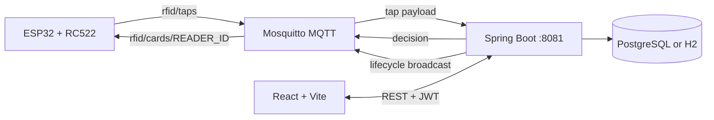

# ZenV Quantum AccessTrack
## End-to-End Project Guide

This document describes the current RFID access-control and attendance platform from hardware input through MQTT, backend processing, persistence, REST APIs, and the React dashboard.

The feature-by-feature QA checklist is available in [FEATURE_TEST_CASES.md](FEATURE_TEST_CASES.md).

## 1. System Purpose

AccessTrack connects ESP32 RFID readers to a Spring Boot backend. A card tap is received through MQTT, validated and processed as an attendance action, persisted in the database, and returned to the reader as a granted or denied decision. Staff users manage people, cards, mappings, attendance, reports, notifications, and audit history through the React web application.

## 2. Repository Layout

```text
RFID/
├── src/main/java/                 Spring Boot application
│   └── com/RFID/RFID/
│       ├── controller/            REST endpoints
│       ├── service/               Business rules
│       ├── mqtt/                  MQTT subscriber and publisher
│       ├── model/                 JPA entities and enums
│       ├── repository/             Spring Data repositories
│       ├── security/               JWT and authorization
│       └── config/                 Database, MQTT, seed, and application config
├── src/main/resources/
│   ├── application.properties     Runtime configuration
│   └── db/migration/              Flyway SQL migrations
├── src/test/java/                 Backend tests
├── frontend/src/                  React pages, components, context, and API client
├── esp32_rfid_mqtt.ino            ESP32 + RC522 firmware
├── mosquitto/config/              Local MQTT broker configuration
├── docker-compose.yml             PostgreSQL, Mosquitto, and backend stack
├── Dockerfile                     Multi-stage frontend/backend image build
└── docs/                          Project and protocol documentation
```

## 3. Runtime Architecture



### Main runtime components

| Component | Responsibility | Local port |
|---|---|---:|
| Spring Boot | REST API, security, attendance rules, MQTT integration | `8081` |
| React/Vite | Staff dashboard | Vite-selected port, commonly `5173` |
| Mosquitto | MQTT broker | `1883`, WebSocket `9001` |
| PostgreSQL | Persistent application data | Docker `5434` -> container `5432` |
| ESP32 | RFID scanning and access feedback | Network device |

Docker Compose maps the backend to host port `8085` and PostgreSQL to host port `5434`. The backend inside Docker still listens on `8081`.

## 4. End-to-End Card Tap Flow

1. The RC522 reads a card UID.
2. The ESP32 normalizes the UID to uppercase hexadecimal and applies a 2-second read cooldown.
3. The ESP32 publishes a JSON tap to `rfid/taps`.
4. Spring Integration MQTT receives the message.
5. `MqttTapSubscriber` validates the device key, reader ID, timestamp, and card UID.
6. `TapService` checks debounce rules, card status, active mapping, person status, reader direction, and attendance-session rules.
7. An `AttendanceEvent` is persisted for the decision.
8. A granted or denied response is published to `rfid/cards/{readerId}`.
9. The ESP32 turns on the green or red LED and activates the buzzer.
10. The dashboard reads attendance and event data through REST endpoints.

## 5. MQTT Contract

### 5.1 Inbound tap: `rfid/taps`

The current ESP32 firmware publishes camelCase fields:

```json
{
  "deviceKey": "RFTSA085E3E85280",
  "readerId": "GATE_01",
  "cardUid": "04A1B2C3D4"
}
```

The backend also accepts legacy snake_case aliases such as `device_key`, `reader_id`, and `card_uid`. A timestamp may be supplied as Unix seconds, milliseconds, or an ISO date-time.

### 5.2 Tap decision: `rfid/cards/{readerId}`

The current `TapResponse` contains these fields:

```json
{
  "decision": "GRANTED",
  "eventType": "CHECK_IN",
  "reason": "OK",
  "isLate": false,
  "occurredAt": "2026-09-16T16:00:48"
}
```

A denied response has `decision: "DENIED"`, a null `eventType`, a reason such as `UNKNOWN_CARD`, `NO_MAPPING`, `CARD_LOST`, or `ALREADY_CHECKED_IN`, and may contain null `isLate`.

### 5.3 Card lifecycle: `rfid/cards`

The backend publishes lifecycle changes to both `rfid/cards` and `rfid/cards/events`.

```json
{
  "timestamp": "2026-09-16 16:00:48",
  "event": {
    "event_type": "CARD_UNASSIGNED",
    "status": "unassigned",
    "card_uid": "CARD_EMP_0105",
    "person_name": "Vikram Malhotra",
    "Type": "EMPLOYEE",
    "counts": {
      "assigned": 14,
      "unassigned": 16,
      "total_cards_active": 30
    },
    "Assigned_card_UID": [
      "CARD_EMP_0102",
      "CARD_EMP_0103",
      "CARD_EMP_0105"
    ]
  }
}
```

`Assigned_card_UID` is the active UID list currently emitted by the publisher. It includes cards with `ASSIGNED` or `AVAILABLE` status and excludes deactivated/lost cards. The lifecycle response does not contain `total_events`.

### 5.4 Lifecycle event sources

- `CARD_ASSIGNED`: mapping created.
- `CARD_UNASSIGNED`: mapping released.
- `CARD_STATUS_CHANGED`: card status changed.
- `CARD_REGISTERED`: new card added.
- `INITIAL_STATE`: published when the backend starts.

### 5.5 MQTT configuration

Configured through environment variables or `application.properties`:

| Variable | Meaning | Default for local development |
|---|---|---|
| `MQTT_ENABLED` | Enable MQTT integration | `true` |
| `MQTT_BROKER_URL` | Broker URI | `tcp://localhost:1883` |
| `MQTT_CLIENT_ID` | Backend client ID | `rfid-backend-service` |
| `MQTT_TOPIC_INBOUND` | Tap topic | `rfid/taps` |
| `MQTT_TOPIC_OUTBOUND_PREFIX` | Feedback prefix | `rfid/cards/` |
| `MQTT_USERNAME` | Broker username | Configure securely |
| `MQTT_PASSWORD` | Broker password | Configure securely |

## 6. Attendance and Card Business Rules

`TapService` evaluates taps in this order:

1. Debounce repeated taps within the configured interval.
2. Resolve the card UID.
3. Reject lost or deactivated cards.
4. Require an active card-to-person mapping.
5. Require an active person.
6. Determine check-in/check-out behavior from the reader ID and open session.
7. Reject duplicate check-ins, invalid sequence times, overlapping sessions, invalid checkout times, or checkout without an open session.
8. Save the event and return the decision.

Important event records are stored even for denied decisions. This is why the attendance event table is an audit stream, not a card-status counter.

## 7. Persistence Model

Flyway migrations are located in `src/main/resources/db/migration`.

| Table | Purpose |
|---|---|
| `people` | Employees and students |
| `staff_users` | Dashboard users, roles, password state |
| `rfid_cards` | Registered physical cards and status |
| `card_mappings` | Current and historical card assignments |
| `attendance_sessions` | Check-in/check-out sessions |
| `attendance_events` | Raw granted and denied tap events |
| `notifications` | Persisted admin/manager alerts |
| `audit_logs` | Administrative and security actions |
| `system_configurations` | Configurable attendance rules |

Card mappings and attendance events should be retained for auditability. A card may be released or deactivated without deleting its historical events.

## 8. REST API Surface

All protected endpoints use:

```http
Authorization: Bearer <JWT>
```

### Authentication

| Method | Endpoint | Purpose |
|---|---|---|
| `POST` | `/api/login` | Authenticate and issue JWT |
| `POST` | `/api/logout` | Blacklist/logout token |
| `GET` | `/api/auth/me` | Read current user |
| `POST` | `/api/auth/change-password` | Change password |
| `POST` | `/api/auth/forgot-password` | Generate reset password |

### People, cards, and mappings

| Method | Endpoint | Purpose |
|---|---|---|
| `GET` | `/api/people` | List/filter people |
| `POST` | `/api/people` | Create person |
| `PUT/PATCH` | `/api/people/{id}` | Update person/status |
| `GET` | `/api/people/{id}/attendance` | Person attendance |
| `GET` | `/api/cards` | List cards |
| `POST` | `/api/cards` | Register card |
| `POST` | `/api/mappings` | Assign card |
| `POST` | `/api/mappings/{id}/release` | Release mapping |
| `POST` | `/api/taps` | Simulate/process a tap through HTTP |

### Attendance, reports, and administration

| Method | Endpoint | Purpose |
|---|---|---|
| `GET` | `/api/attendance/live` | Live attendance view |
| `GET` | `/api/attendance/sessions` | Session data |
| `GET` | `/api/attendance/report` | Attendance report |
| `GET` | `/api/attendance/report/export` | Export report |
| `GET` | `/api/dashboard/analytics` | Dashboard analytics |
| `GET` | `/api/events` | Access events |
| `GET` | `/api/audit-log` | Audit entries |
| `GET` | `/api/notifications` | Admin/manager notifications |
| `POST` | `/api/notifications/{id}/read` | Mark notification read |
| `GET` | `/api/config` | Read system configuration |
| `POST` | `/api/config/purge-test-data` | Purge test data |
| `GET` | `/api/health` | Health check |
| `GET` | `/api/users` | Staff users |

OpenAPI/Swagger is available through the SpringDoc configuration when the application is running.

## 9. Frontend Application

The frontend is a React 19 application built with Vite. Its API client is `frontend/src/utils/api.js`.

### Main screens

- Login and password reset.
- Dashboard analytics and charts.
- Live attendance.
- People directory.
- Card inventory and mapping.
- Access logs.
- Audit logs.
- Reports and CSV export.
- Staff users.
- System settings.

The API client automatically adds the JWT from browser storage, unwraps successful backend envelopes, redirects to login on HTTP 401, and triggers a refresh event after successful mutations.

## 10. Roles

| Capability | ADMIN | MANAGER | OPERATOR |
|---|:---:|:---:|:---:|
| View dashboard, people, cards, attendance | Yes | Yes | Yes |
| Assign/release cards | Yes | Yes | No |
| Create/update people | Yes | Yes | No |
| Reports and exports | Yes | Yes | No |
| Staff-user management | Yes | No | No |
| System configuration | Yes | No | No |
| Audit log access | Yes | No | No |

## 11. Notifications

Persisted notifications are visible to Admin and Manager users through the header notification bell. Current generated notification types include:

- `PASSWORD_CHANGED`
- `PASSWORD_RESET`
- `CARD_LOST`
- `REPEATED_DENIAL`
- `AUTO_CHECKOUT_SUMMARY`

These are application notifications, not MQTT lifecycle messages.

## 12. Local Development

### Prerequisites

- JDK 21.
- Maven 3.9+ or the included Maven wrapper.
- Node.js 20+ and npm.
- Mosquitto and a database, or Docker Desktop.

### Option A: Run dependencies with Docker

```powershell
docker compose up -d db mosquitto
```

The Compose database is available on host port `5434`; the broker is available on `1883`.

### Start backend

```powershell
./mvnw.cmd spring-boot:run
```

The backend is available at `http://localhost:8081` unless `PORT` is set.

### Start frontend

```powershell
Set-Location frontend
npm install
npm run dev
```

Vite prints the actual URL and port in the terminal. The frontend proxy forwards `/api` requests to the backend according to `frontend/vite.config.js`.

### Build and test

```powershell
./mvnw.cmd clean test
Set-Location frontend
npm run lint
npm run build
```

## 13. Docker Deployment

Build and start the complete stack:

```powershell
docker compose up -d --build
```

Services:

- Frontend and backend are served by the backend container on `http://localhost:8085`.
- PostgreSQL is exposed on `localhost:5434`.
- MQTT is exposed on `localhost:1883`.
- MQTT WebSocket traffic is exposed on `localhost:9001`.

Useful commands:

```powershell
docker compose ps
docker compose logs -f backend
docker compose logs -f mosquitto
docker compose down
```

Do not use `docker compose down -v` unless database and broker volumes are intentionally being deleted.

## 14. MQTT Verification

Subscribe to broker traffic:

```powershell
mosquitto_sub -h localhost -p 1883 -u <user> -P <password> -t "rfid/#" -v
```

Publish a simulated tap:

```powershell
mosquitto_pub -h localhost -p 1883 -u <user> -P <password> `
  -t "rfid/taps" `
  -m '{"deviceKey":"RFTSA085E3E85280","readerId":"GATE_01","cardUid":"CARD_EMP_0102"}'
```

If an old lifecycle payload still contains `total_events`, check these causes:

1. An old backend JVM is still running.
2. A retained/history message is being displayed by the MQTT client.
3. A different broker or backend instance is being used.
4. Docker is running an image built before the source change.

Restart the backend or rebuild the Docker image, then publish a new lifecycle event.

## 15. Configuration and Security

Use environment variables for deployment secrets. At minimum, override:

- `JWT_SECRET`
- `MQTT_USERNAME`
- `MQTT_PASSWORD`
- `DEVICE_KEY`
- `SPRING_DATASOURCE_USERNAME`
- `SPRING_DATASOURCE_PASSWORD`
- `SPRING_MAIL_USERNAME`
- `SPRING_MAIL_PASSWORD`

Do not commit real passwords, SMTP credentials, or production broker credentials. Use a long random JWT secret in every non-local environment. Restrict MQTT users and topics in Mosquitto configuration, and use TLS for production traffic.

## 16. Troubleshooting

### Backend will not start

- Confirm Java 21: `java -version`.
- Check port `8081`.
- Check database URL and credentials.
- Check Flyway migration logs.
- Check MQTT broker reachability.

### MQTT messages are not received

- Confirm Mosquitto is listening on `1883`.
- Confirm `MQTT_ENABLED=true`.
- Confirm broker credentials.
- Subscribe to `rfid/#` and inspect the actual topic.
- Confirm the ESP32 broker IP is reachable from its network.

### Access is denied unexpectedly

Check the response `reason`. Common causes are `UNKNOWN_CARD`, `NO_MAPPING`, `CARD_LOST`, `CARD_DEACTIVATED`, `PERSON_INACTIVE`, `DEBOUNCED`, `ALREADY_CHECKED_IN`, and `NOT_CHECKED_IN`.

### Frontend shows stale data

- Confirm the browser is using the current backend URL.
- Clear the JWT and sign in again after security changes.
- Check the browser network tab for `/api` failures.
- Restart Vite after proxy configuration changes.

## 17. Source of Truth

When documentation conflicts with runtime behavior, use this order:

1. Current Java and React source code.
2. `application.properties` and environment variables.
3. Flyway migrations and tests.
4. Existing Markdown documentation.

The current lifecycle payload source is `MqttPublisherService`, and the current tap decision source is `TapResponse` plus `TapService`.
